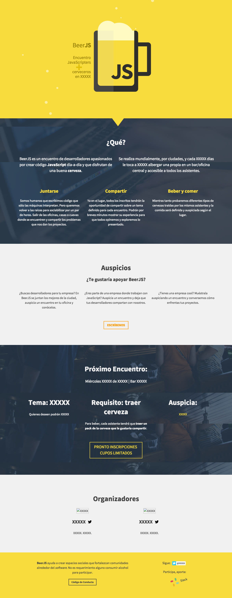

BeerJS Santiago base theme
=====================

> This not *plug-and-play*. You'll have to make it work first.

This base theme is being used in [BeerJS Santiago website](http://www.beerjs.cl). It has been relesead as requested and [can be used
freely](LICENSE).

##Design:

##Requirements:
- NodeJS, NPM, Bower, SCSS, GruntJS.

##Use:
- Clone/download this.
- Install dependencies: `npm install && bower install`
- Init: `grunt init`
- Compile & Run: `grunt`
- Modify: `grunt watch`

**Happy Coding :)**
